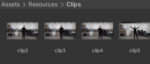
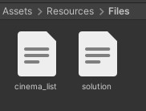
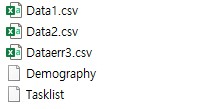

## User-Evaluation

##### : Video Data 감정 평가 도구

---

**작성자 : 한양대학교 HCI Lab 배정은**

#### :exclamation: 주의 사항 :exclamation:

1. <b>Video 파일 위치 설정</b>
   
   - Video 파일은 Assets/Resources/Clips 폴더 위치 내에 존재하면 됩니다.
     
     

2. <b>Video 파일 List, Solution 파일 위치 설정</b>
   
   - Assets/Resources/Files 폴더 위치 내에 존재하면 됩니다.
     
     

#### :arrow_forward: Output 파일

> Output 파일 위치  : ``Desktop/Data/<피험자ID>/``

1. **Data<Task번호>.csv**
   
   - anime_index : 실행된 비디오 클립 제목
   
   - answer : 피험자가 선택한 감정
     
     > (1 : 행복, 2 : 슬픔, 3 : 놀람, 4 : 분노, 5 : 혐오, 6 : 공포, 7 : 중립)
   
   - task_time : 하나의 비디오를 시청하고 감정을 판단하는 시간 (영상 시간 포함)
   
   - replay_time: replay를 한 횟수
   
   - error : 해당 비디오가 에러인지 아닌지
     
     > (0 : 정상, 1 : 에러)
   
   - count : 피험자가 선택한 감정들 중에서 정답인 갯수 

2. **Dataerr<Task번호>.csv**
   
   - Data.csv와 동일하나 피험자가 중단한 시점까지 저장

3. **Demography**
   
   >  하나의 Task가 끝날 경우 기록
   
   - 이름 : 피험자 이름
   
   - 실험 ID : 피험자 실험 ID
   
   - Exp_Num : 실험 Task 번호
   
   - 실험시작시각, 실험 종료시각 : 하나의 Task를 진행하는 시작, 종료 시각 
   
   - 실험시간 : 모든 비디오 Task_Time의 총합
   
   - 정답률 : Data.csv에서 저장된 count 피험자가 선택한 감정들 중에서 정답인 갯수)

4. **Tasklist**
   
   > 현재 진행하고 있는 Task 기록
   
   - 피험자 Name : 피험자 이름
   
   - Current Exp_Task_Num : 피험자가 실험해야하는 Task 번호 (해야 할 Task)
